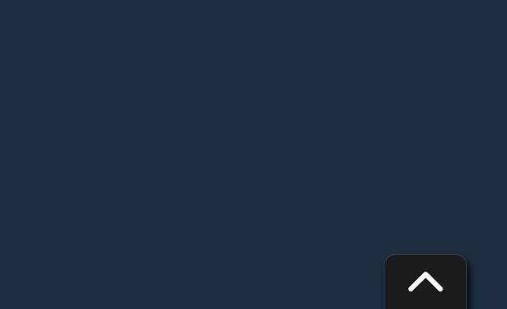

# Gemma Scroll-To-Top button
## About

In the simplest way, it adds a scroll-to-top button to a website.
https://www.npmjs.com/package/gemma-scroll-top



## Installation

```
yarn add gemma-scroll-top
or
npm install gemma-scroll-top
```

In javascript file add:

```
import scroll from 'gemma-scroll-top';
scroll.scrollTop(offset); 

// int offset - optional -> Sets the distance from the top of the page after which, when scrolled, the button appears.
```

...and in scss add line:
```
@import 'gemma-scroll-top/style';
```
